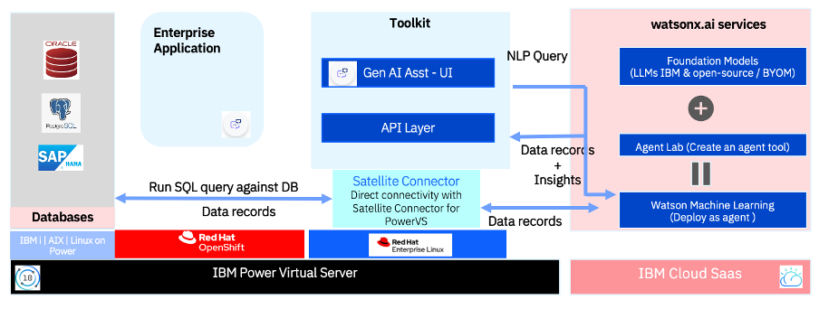
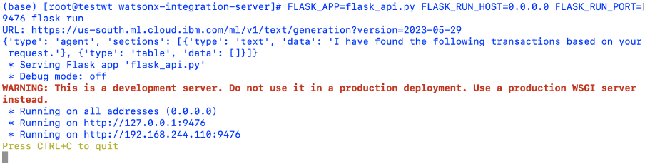

---

copyright:
  years: 2025, 2025
lastupdated: "2025-07-02"

keywords: Power Virtual Server, IBM Power Virtual Server, watsonx, Toolkit, Artificial Intelligence, AI

authors:
  - name: DIVYA KULKARNI
    url: https://linkedin.com

subcollection: powervs-watsonx-toolkit

content-type: solution

use-case: AIAssistants, AIBanking, AIFrameworks, AIProductivity, ConversationalAI, HybridIntegration, NaturalLanguageProcessing

industry: Banking, FinancialSector, ITConsulting, Insurance, Manufacturing, Technology

compliance: AIAct, IBMCloudFFS

---

{{site.data.keyword.attribute-definition-list}}


# Toolkit for watsonx to {{site.data.keyword.powerSys_notm}} integration with Satellite Connector
{: #toolkit2}
{: toc-use-case="AIAssistants, AIBanking, AIFrameworks, AIProductivity, ConversationalAI, HybridIntegration, NaturalLanguageProcessing"}
{: toc-industry="Banking, FinancialSector, ITConsulting, Insurance, Manufacturing, Technology"}
{: toc-compliance="AIAct, IBMCloudFFS"}

IBM provides an open-source [Toolkit With Satellite Connector](https://github.com/IBM/PowerVS_watsonx_SatelliteConnectorBasedToolkit), for businesses aiming for expedited AI incorporation into {{site.data.keyword.powerSys_notm}} applications and datasets. This toolkit, based on the Satellite Connector framework, functions as a do-it-yourself(DIY) resource for crafting and personalizing Generative AI and agent-driven applications.
{: shortdesc}


## Benefits
{: #Benefits}

IBM's Toolkit accelerates AI development, minimizing effort and simplifying {{site.data.keyword.powerSys_notm}} adoption by offering a foundational framework for Generative AI use case prototyping. The Satellite Connector component ensures secure data access to watsonx through TLS tunneling, addressing enterprise data security concerns.


## When to choose Toolkit with Satellite Connector
{: #when}

* Opt for the Toolkit with Satellite Connector when your organization needs a secure and efficient approach to incorporating Generative AI into {{site.data.keyword.powerSys_notm}} applications and datasets. This toolkit is especially advantageous if you aim to lessen development effort, simplify AI adoption, and tackle enterprise-grade data security issues. The Satellite Connector's TLS tunneling guarantees secure data access to watsonx, making it an excellent choice for businesses emphasizing data protection and compliance.
* Furthermore, if you're looking for a customizable solution to create Generative AI and agent-driven applications, this toolkit provides the adaptability and base required for your unique use cases.
* Some potential use cases for the Toolkit with Satellite Connector include Automated Quote Generation, Intelligent Order Processing, Automated Contract Generation, Automated Claim Creation, Intelligent Claims Assessment, and Premium Calculation.


## Reference Architecture
{: #reference-architecture}


{: caption="Reference Architecture" caption-side="bottom" }{: style="text-align: center;"}


The above reference architecture diagram illustrates the Toolkit architecture for NLP2 SQL with Insights, highlighting its modular design and key considerations.

RedHat OpenShift Container Platform is optional, and Toolkit can be installed directly on RHEL as explained in further sections.

The overall structure is divided into several components:
* Databases which have mission critical data on Power VS
    * Toolkit currently supports below three databases:
        * Oracle,
        * PostgreSQL, and
        * SAP HANA
* An Enterprise Application depending on the client domain(Manufacturing, Retail,  BFSI, etc..)
    * An example in Financial domain can be a core banking
* Toolkit –API layer and Digital Assistant layer
    * Toolkit provides API layer based on REST/FLASK to establish communication with watsonx services and Digital Assistant that can integrated into the existing web application, User Interface
* Satellite Connector created on IBM Cloud
    * The Satellite Connector ensures secure TLS tunneling for communication between applications and services operating in hybrid and multi-cloud settings.
* watsonx services – watsonx.ai and watsonx agent
    * The Watson AI Services, provided by IBM Cloud SaaS, include Foundation Models, Prompt Lab, Watson Machine Learning, which support the Toolkit by deploying pre-packaged LLM models and tuning them as needed and
    * watsonx Agent Lab provides the ability to create and deploy custom agents.


## Set up Instructions
{: #setup}

### Step 1: Prepare the System
{: #step-1}

For Fedora/CentOS9Stream, you may need to install the following Linux packages:
* diffutils
* file
* gcc
* libpq-devel
* openssl-devel
* podman
* postgresql-devel
* python3.10-devel (or greater)

For a different version of Linux you will have to install the corresponding packages.


### Step 2: Clone the Toolkit repo
{: #step-2}

```
git clone https://github.com/IBM/PowerVS_watsonx_SatelliteConnectorBasedToolkit.git
```

### Step 3: Install Python
{: #step-3}

Ensure Python3.10+ and pip is installed
You can do this in several ways:
* Install in the system as root
* Install as a virtualized Python using venv or equivalent


### Step 4: Install packages
{: #step-4}

Install packages from requirements.txt
```
pip install -r requirements.txt
```

Requirements.txt
```
# Core packages
flask
gevent
python-dotenv
requests
setuptools

# Database specific packages
psycopg2
oracledb
hdbcli
```


When working with different database systems in python, specific adapters and extension modules are required to establish connections and execute database operations.

* psycopg2: A database adapter that follows the DB API 2.0 standard, designed specifically for PostgreSQL. It is essential for interacting with PostgreSQL databases.
* oracledb: A python extension module that enables seamless connections to Oracle databases, allowing efficient data access and manipulation.
* hdbcli: A dedicated python extension module for SAP HANA, facilitating integration and database operations.

By default, Toolkit supports all three databases: Oracle, PostgreSQL, and SAP HANA. If your project does not involve PostgreSQL, Oracle, or SAP HANA, you can simply exclude psycopg2, oracledb, or hdbcli from the requirements.txt file, keeping dependencies minimal and relevant.


### Step 5: Verify Package Installation
{: #step-5}

Ensure all packages are installed correctly by listing installed packages:

```
pip list
```


### Step 6  : Update Config.ini in watsonx-integration-server Folder
{: #step-6}

Go to the folder “watsonx-integration-server” open the configuration file ‘Config.ini’  and update accordingly

Config.ini

```
[apiserver]
port=2005

[apikey]
api_key=XXXXXXXXX


[llminferences]
No_of_inferences=3

[llmurl1]
url=https://eu-de.ml.cloud.ibm.com/ml/v1/text/generation?version=2023-05-29

[llmurl2]
url= https://eu-de.ml.cloud.ibm.com/ml/v4/deployments/7057d8870/ai_service?version=2021-05-01
```


* [apiserver]

    Port: Provide the port number at which the flask server must run. Refer [here](/docs/power-iaas?topic=power-iaas-network-security) for the list of fixed firewall ports open on the Juniper vSRX firewalls on {{site.data.keyword.powerSys_notm}}.

* [apikey]

    api_key:  Create a personal API key, and use it to create temporary access tokens.

* [llminferences]

    no_of_inferences : This provides the total number of scoring endpoints referenced in the application(includes LLM and agents)


* [llmurl1],[llmurl2],……… [llmurln] where n=no_of _inferences

    The provided URLs, [llmurl1],[llmurl2],……… [llmurln], are endpoints for scoring the Language Learning Model (LLM) or agent. The 'n' in these URLs represents the number of inferences, which refers to the number of times the model processes input data to generate output. no_of_inferences above must match the number of endpoints defined.
    * The output of one endpoint is the input of the subsequent endpoint.
    * In our example we have three endpoints.

    These agents are hosted on the Watsonx AI service and can be developed using a variety of frameworks including LangGraph, LlamaIndex, CrewAI, AutoGen, BeeAI React Agent, and BeeAI Workflow. For more examples of these agents, you can refer to the [github repository](https://github.com/IBM/watsonx-developer-hub/tree/main/agents).

    The agent in this case was developed using the Watsonx Agent Lab, but the same principles apply to agents created with any of the mentioned frameworks. These agents can be deployed as AI services. The provided links also offer examples on how to deploy on IBM Cloud.

    For how to build and deploy agents to watsonx.ai from your Integrated Development Environment (IDE), please visit [instructions](https://www.ibm.com/new/announcements/build-and-deploy-agents-to-watsonx-ai-from-your-ide). The sample agent code for your reference, which connects to an Oracle DB on Power Virtual System is provided in step 9.


### Step 7:  configure the response structure
{: #step-7}

The resp_config.json file defines the expected structured response format from an LLM that interacts with the Toolkit. Defining the format allows an LLM to generate structured, machine-readable responses, ensuring easy integration with API layer.

resp_config.json
```
{
    "type": "agent",
    "sections": [
        {
            "type": "text",
            "data": "I have found the following transactions based on your request."
        },
        {
            "type": "table",
            "data": []
        }
    ]
}
```


The resp_config.json file defines the expected structured response format from an LLM that interacts with the Toolkit. Defining the format allows an LLM to generate structured, machine-readable responses, ensuring easy integration with API layer.

type: "agent"
:   Indicates that the response is coming from an AI agent.

sections
:   A list that contains different types of response elements.


* First section:

    ```
    {
                "type": "text",
                "data": "I have found the following transactions based on your request."
            },
    ```

   - type: "text" → This section contains textual data.
   - data: A string message informing the user about retrieved  transactions (editable for custom message).

* Second section:
    ```
    {
                "type": "table",
                "data": []
            }
    ```

   - type: "table" → This section is meant to hold tabular data.
   - data: [] (Empty array) → In case no transactions were found.


### Step 8: Provide  JSON configurations for LLM models
{: #step-8}


* For every LLM model you intend to infer, you must supply a corresponding JSON configuration file. This file, named 'llm_params_config_n.json', forms the body of the request sent to the Watsonx AI service.
* The 'n' in llm_params_config_n.json  signifies the order of the LLM model in the sequence of inferences.
* For instance, if you are only inferring one LLM model, you'll need a single JSON file named 'llm_params_config.json'. If you're inferring two models, you'll require two JSON files: 'llm_params_config.json' for the first model and 'llm_params_config_2.json' for the second
* Following this pattern, if you're inferring three LLM models, the third model's JSON file would be named 'llm_params_config_3.json'.
* For example the first LLM model, llm_parames_config.json, might look like

llm_params_config.json:
```
{
  "input": "You are a developer writing SQL queries given natural language questions. The database contains a set of 3 tables. The schema of each table with description of the attributes is given. Write the SQL query given a natural language statement with names being not case sensitive
Here are the 3 tables :
    1. Database Table Name: USERS
        Table Schema:
        Column Name # Meaning
        user_id # unique identifier of the user,
        user_type_id # user is 'employee','customer'
        gender_id # user's gender is 1 for female, 2 for male and 3 for other
        dob # date of birth of the user
        address # address of the user
        state # state of the user
        country # country of residence of the user
        pincode # postalcode of the user residence
        email # email address of the user
        first_name # first name of the user
        last_name # last name of the user
    2. Database Table Name: ACCOUNTS
        Table Schema:
        Column Name # Meaning
        acc_id # account number or account id of the user
        u_id # user id of the user
        balance # available balance in the account
    3. Database Table Name: TRANSACTIONS
        Table Schema:
        Column Name # Meaning
        transaction_id # unique id for the transaction
        tran_type_id # transaction type is 1 for debit and 2 for credit
        transaction_amount # amount transferred from from_acc_id to to_acc_id
        tran_date # date and time of the transaction
        status_type_id # status of the transaction is 1 for Success and 2 for Failed
        from_acc_id # account number from which the transaction is initiated
        to_acc_id # account number to which the transaction is targeted
        fraud_score # score to indicate if the transaction is fraudulent or not, 1 is fraud and 0 is not fraud
        fraud_category # fraud category is 1 for location, 2 for amount

        Input: List fraudulent transactions in last two days
        Output: select * from transactions, accounts, users where transactions.from_acc_id=accounts.acc_id and accounts.u_id=users.user_id and transactions.fraud_score=1 and transactions.tran_date>=date(now())-interval '2 day';

        Input: {user_query}
        Output:",
        "parameters": {
            "decoding_method": "greedy",
            "max_new_tokens": 100,
            "repetition_penalty": 1
        },
        "model_id": "mistralai/mixtral-8x7b-instruct-v01",
        "project_id": "abc12341-xyzl-3456-5867-az78910a2030",
        "moderations": {
            "hap": {
            "input": {
                "enabled": true,
                "threshold": 0.5,
                "mask": {
                "remove_entity_value": true
                }
            },
            "output": {
                "enabled": true,
                "threshold": 0.5,
                "mask": {
                "remove_entity_value": true
                }
            }
            }
        }
        }
```


The Json structure here constitutes the body of the request sent to watsonx.ai service. Below is the description:
* input: Contains a text prompt formatted in a specific syntax indicating roles and their inputs. Can include database schema with sample NLP statement and equivalent SQL
* Query parameters: This object contains various parameters for the text generation process:
    * decoding_method: The method used to generate the text. In this case, it's set to "greedy".
    * max_new_tokens: The maximum number of new tokens (words) to generate. Here, it is set to 100.
    * repetition_penalty: A value that discourages the model from repeating the same text. Here, it is set to 1.
* model_id: The ID of the model to use for text generation
* project_id: The ID of the project associated with the model.
* moderations: This object contains settings for moderating the generated text. Here, it includes settings for handling sensitive information (PII) and harmful content (HAP). Both are set to mask any sensitive information with a threshold of 0.5.

### Step 9: Set up satellite connector  and agent
{: #step-9}

In this NLP2SQL use case requires the agent to establish a connection with the database located on {{site.data.keyword.powerSys_notm}} via a Satellite Connector. For guidance on creating and operating a satellite connector agent, please consult the [IBM Satellite Connector documentation](https://cloud.ibm.com/docs/satellite?topic=satellite-create-connector&interface=ui).

Below is a sample agent code for your reference, which connects to an Oracle DB on Power Virtual System. Please adjust this code as necessary to accommodate your preferred database.

```
def sqlexecute(dbuser,dbpwd,database,dbhost,dbport,dbquery):

  import os
  os.system('pip install oracledb')

  import datetime
  import oracledb
  import json

  dsn_name = dbhost+':'+str(dbport)+'/'+database
  conn=oracledb.connect(user=dbuser,
                             password=dbpwd,
                             dsn=dsn_name)
  cursor = conn.cursor()
  JSON_SQL_QUERY = "select JSON_OBJECT(*) from (" + dbquery + ")"
  cursor.execute(JSON_SQL_QUERY)
  records=cursor.fetchall()
  cursor.close()
  conn.close()
  return records
```


### Step 10: Run Flask App in watsonx-integration-server Folder
{: #step-10}

Go to the folder “watsonx-integration-server” and run flask application as shown below :

```
python flask_api.py
```


Sample Output :

{: caption="Sample output" caption-side="bottom" }{: style="text-align: center;"}


### Step 11: Set up Gen AI Assistant
{: #step-11}

To set up Gen AI Assistant follow the instructions in the [readme](https://github.com/IBM/PowerVS_watsonx_SatelliteConnectorBasedToolkit/blob/main/chatbot_ui/README.md)
