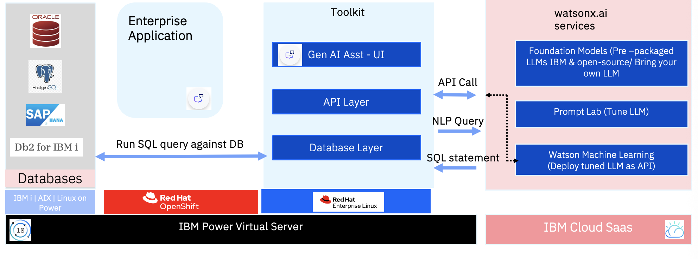
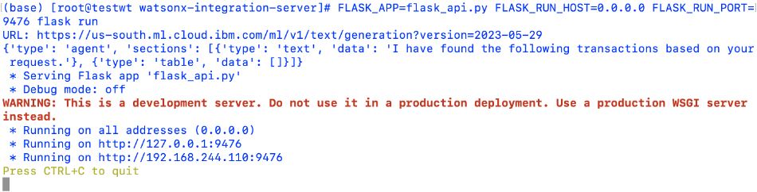

---

copyright:
  years: 2022
lastupdated: "2025-02-27"

keywords: IBM PowerVS, IBM Power Virtual Server, watsonx , Toolkit, PowerVS, Power virtual server

subcollection: powervs-watsonx-toolkit

---
{{site.data.keyword.attribute-definition-list}}

# NLP2SQL Toolkit: Watsonx and {{site.data.keyword.powerSysFull}}
{: #NLP2SQL}

## API-based Toolkit for NLP2SQL use-case
{: #about}

The NLP2SQL Toolkit serves as a structured set of tools and resources, which are designed to expedite AI adoption by integrating watsonx with {{site.data.keyword.powerSys_notm}} for natural language input to SQL type scenarios. The NLP2SQL Toolkit, henceforth referred as Toolkit can address domain-specific inquiries, all without necessitating the acquisition of specialized expertise. Essentially, it is a holistic approach that is geared toward reducing the time that is spent on development. Amplifying the potential for reuse of existing components, and extracting valuable, actionable insights from enterprise data

The Toolkit converts simple text-based questions such as What were the top-selling products last quarter? into SQL queries that retrieve the necessary data. The use of this toolkit eliminates reliance on technical teams, speeding up decision-making processes and significantly cutting down on the time that is required to implement these new features to fruition.

With the ready-to-use NLP2SQL Toolkit, businesses can simplify data analysis. Whether it's a sales manager, assessing product performance, or a finance team monitor revenue trend, this AI-powered tool makes data analysis more accessible, efficient, and actionable for all.

## Key Benefits
{: #Benefits}

- **Accelerated development timelines:** Since it is modular, Toolkit minimizes the effort and time that is required for AI integration within enterprise applications.
- **Enhanced reusability:** Use the modular architecture to reuse individual components across multiple use cases, such as user interfaces.
- **Secure insights:** Gain valuable insights from mission-critical data without migrating it, ensuring data stays secure within your enterprise.


## Reference Architecture
{: #achitecture-diagram}

{: caption="Reference Architecture" caption-side="bottom" }{: style="text-align: center;"}


The preceding reference architecture diagram illustrates the Toolkit architecture for NLP2 SQL, highlighting its modular design and key considerations.

{{site.data.keyword.redhat_openshift_full}} Container Platform is optional, and Toolkit can be installed directly on RHEL as explained in further sections.

The overall structure is divided into several components:
-   Databases, which have mission-critical data on {{site.data.keyword.powerSys_notm}}
-   An Enterprise Application, for example, a core banking enterprise application
-   API-based NLP2SQL Toolkit and
-   Watsonx AI Services.

Databases that are supported include SAP HANA, Oracle, and Postgres SQL, which interact with the Enterprise Application.

The Toolkit comprises three main layers:
-   Gen AI Assistant - UI layer
-   API Layer
-   Database Layer.

These layers facilitate API calls and NLP queries, converting natural language inputs into SQL statements.

The watsonx.ai services, provided by IBM Cloud SaaS, include foundation models, prompt lab, and watsonx machine learning, which support the Toolkit by deploying pre-packaged LLM models and tuning them as needed.

Overall, the diagram conveys a modular and scalable architecture that is designed to integrate watsonx.ai and {{site.data.keyword.powerSys_notm}} functions seamlessly.


## Installation
{: #How-to-install}

The following instructions help to install and set up Toolkit on {{site.data.keyword.powerSys_notm}} integrating with watsonx.ai services

The following instructions are not platform specific and any platform-specific library decencies must be resolved by self
{: note}

### Step 1
{: #step-1}

Log in to the VM. Git clone the Toolkit repo. [Git clone the Toolkit repo](https://github.ibm.com/AIonPower/powervs_watsonx_Toolkit.git)

### Step 2
{: #step-2}

Ensure Python3.8+ and pip is installed

```python
python -version
```
{: codeblock}

OR
```python
python3 -version
pip version
```
{: codeblock}

If Python or pip is not installed, download Python from python.org and pip typically come bundled with it.

### Step 3
{: #step-3}

 Install packages from requirements.txt (present in the code)

```python
pip install -r requirements.txt
```
{: codeblock}

`Requirements.txt`
```text
flask
gevent
python-dotenv
psycopg2
flask_cors
oracledb
hdbcli
```

Working with different database systems in Python, specific adapters and extension modules are required to establish connections and run database operations.

-   'psycopg2': A database adapter that follows the DB API 2.0 standard, which is designed specifically for PostgreSQL. It is essential for interacting with PostgreSQL databases.
-   'oracledb': A Python extension module that enables seamless connections to Oracle databases, allowing efficient data access and manipulation.
-   'hdbcli': A dedicated Python extension module for SAP HANA, facilitating integration and database operations.

By default, the Toolkit supports all three databases: Oracle, PostgreSQL, and SAP HANA. If your project does not involve PostgreSQL, Oracle, or SAP HANA, you can exclude psycopg2, oracledb, or hdbcli from the requirements.txt file, keeping dependencies minimal and relevant.

### Step 4
{: #step-4}

Ensure that all packages are installed correctly by listing installed packages:

```python
pip list
```
{: codeblock}

### Step 5
{: #step-5}

Go to the folder “watsonx-integration-server” open the configuration files and update the following parameters:

`Config.ini`
```text
[apiserver]
port=9476

[llmurl]
url=https://us-south.ml.cloud.ibm.com/ml/v1/text/generation?version=2023-05-29

[apikey]
api_key=LKFMSDLFSFXXXXXXXXXXXXrV
```


- [apiserver]

Port: Provide the port number at which the flask server must run

- [llmurl]

url: Provide the LLM scoring endpoint deployed on watsonx

- [apikey]

api_key:  [Create a personal API key](https://cloud.ibm.com/iam/apikeys), and use it to create temporary access tokens.


`resp_config.json`
```text
{
    "type": "agent",
    "sections": [
        {
            "type": "text",
            "data": "I have found the following transactions based on your request."
        },
        {
            "type": "table",
            "data": []
        }
    ]
}
```

The `resp_config.json` file defines the expected structured response format from an LLM that interacts with the toolkit. Defining the format allows an LLM to generate structured, machine-readable responses, ensuring seamless integration with API layer.

`type: "agent"`: Indicate that the response is coming from an AI agent.
`sections`: A list that contains different types of response elements.

-	**First section:**


    - Type: "text" - This segment holds written information.
    - Data: A string message informs the user about retrieved transactions.


```text
{
            "type": "text",
            "data": "I have found the following transactions based on your request."
        },
```


- **Second section:**

    - Type: "table" - This segment is meant to hold tabular data.
    - Data: [] (Empty array) - In case no transactions were found.

```text
{
            "type": "table",
            "data": []
        }
```


`llm_params_config.json`
```text
{
  "input": "You are a developer writing SQL queries given natural language questions. The database contains a set of 3 tables. The schema of each table with description of the attributes is given. Write the SQL query given a natural language statement with names being not case sensitive
Here are the 3 tables :
1)	Database Table Name: USERS
Table Schema:
Column Name # Meaning
user_id # unique identifier of the user,
user_type_id # user is 'employee','customer'
gender_id # user's gender is 1 for female, 2 for male and 3 for other
dob # date of birth of the user
address # address of the user
state # state of the user
country # country of residence of the user
pincode # postalcode of the user residence
email # email address of the user
first_name # first name of the user
last_name # last name of the user
2)	Database Table Name: ACCOUNTS
Table Schema:
Column Name # Meaning
acc_id # account number or account id of the user
u_id # user id of the user
balance # available balance in the account
3)	Database Table Name: TRANSACTIONS
Table Schema:
Column Name # Meaning
transaction_id # unique id for the transaction
tran_type_id # transaction type is 1 for debit and 2 for credit
transaction_amount # amount transferred from from_acc_id to to_acc_id
tran_date # date and time of the transaction
status_type_id # status of the transaction is 1 for Success and 2 for Failed
from_acc_id # account number from which the transaction is initiated
to_acc_id # account number to which the transaction is targeted
fraud_score # score to indicate if the transaction is fraudulent or not, 1 is fraud and 0 is not fraud
fraud_category # fraud category is 1 for location, 2 for amount

Input: List fraudulent transactions in last two days
Output: select * from transactions, accounts, users where transactions.from_acc_id=accounts.acc_id and accounts.u_id=users.user_id and transactions.fraud_score=1 and transactions.tran_date>=date(now())-interval '2 day';
 Input: {user_query}\nOutput:",

"parameters": {
    "decoding_method": "greedy",
    "max_new_tokens": 100,
    "repetition_penalty": 1
  },
"model_id": "mistralai/mixtral-8x7b-instruct-v01",
 "project_id": "1ab727c4-4c22-4d9b-8fce-398febec3c5c",


"moderations": {
    "hap": {
      "input": {
        "enabled": true,
        "threshold": 0.5,
        "mask": {
          "remove_entity_value": true
        }
```

The JSON structure here constitutes the body of the request, sent to the watsonx.ai service. Descriptions listed:
- input: Contain a text prompt formatted in a specific syntax, indicating roles and their inputs. Can include a database schema with sample NLP statement and equivalent SQL
- Query parameters: This object contains various parameters for the text generation process:
-   decoding_method: The method used to generate the text. In this case, it is set to "greedy".
-   max_new_tokens: The maximum number of new tokens (words) to generate. Here, it is set to 100.
-   repetition_penalty: A value that discourages the model from repeating the same text. Here, it is set to 1.
- model_id: The ID of the model to use for text generation
- project_id: The ID of the project associated with the model.
- moderations: This object contains settings for moderating the generated text. Here, it includes settings for handling sensitive information (PII) and harmful content (HAP). Both are set to mask any sensitive information with a threshold of 0.5.


### Step 6
{: #step-6}

Go to the folder “database-integration-service” open the database configuration file `config.ini` and update the following fields:

`config.ini`
```text
[database]
dbtype=1
user=bnk_db
password=xxxx
host=xx.xx.xx.xx
port=1521
dbname=bankdb
```

The following are the values for different databases:
-	dbtype  = 1 for Oracle DB
-	dbtype  = 2 for postgres
-	dbtype  = 3 for HANA DB

Where
- User: username used to authenticate with the database.
- Password: password associated with the username
- Host: host / IP address where the database is located
- Port: port number where the database is listening for connections
- Dbname: Name of the database or if SAP HANA is the database, it also serves as the schema name

Open the file `database_integrate.py` and comment the lines based on the databases you are not using (Oracle, PostgreSQL, or SAP HANA):

```text
import oracledb
import psycopg2
from hdbcli import dbapi
```

### Step 7
{: #step-7}

Go to the folder “watsonx-integration-server” and run flask application as shown in the following example:

```python
FLASK_APP=flask_api.py FLASK_RUN_HOST=0.0.0.0 FLASK_RUN_PORT=9476 flask run
```
{: codeblock}

Sample output:

{: caption="sample output" caption-side="bottom" }{: style="text-align: center;"}

### Step 8
{: #step-8}

To set up gen AI Assistant, follow the instructions in the [readme file link](https://github.ibm.com/AIonPower/powervs_watsonx_Toolkit/blob/main/chatbot_ui/README.md)

## Demo video
{: #demo-video}

[Demo video - NLP2SQL Toolkit](https://mediacenter.ibm.com/media/Infusing+AI+into+mission+critical+workloads+with+PowerVS+and+watsonx.ai/1_fzqutamr)
