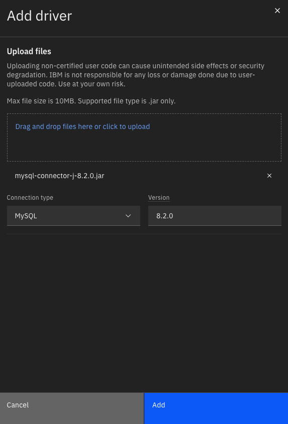
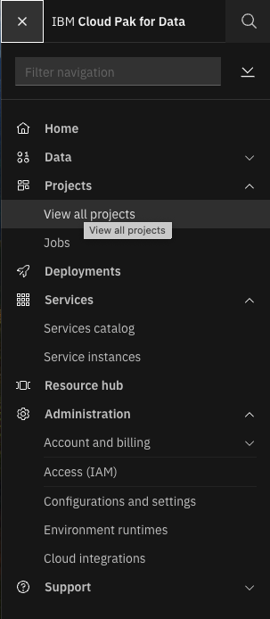

---

copyright:
   years: 2025, 2025
lastupdated: "2025-06-04"

keywords:

subcollection: powervs-watsonx-toolkit

content-type: tutorial
services: power-iaas, watsonx, satellite
account-plan: paid # Set `lite` if tutorial can be completed by using only Lite plan services; Set `paid` if the tutorial requires a pay-go or subscription versions of plans for the service
completion-time: 2h # Estimated time to complete the steps in this tutorial. Minute values are supported up to 90 minutes. Whole hours are also supported; for example: 2h

---

{{site.data.keyword.attribute-definition-list}}

# Integrate watsonx services with workloads hosted on Power Virtual Server
{: #tutorial-watsonx-to-powervs}

This tutorial shows the detailed steps on how to connect watsonx as-a-Service to the private workloads hosted on {{site.data.keyword.powerSys_notm}}.
{: shortdesc}


IBM Cloud Services (eg. watsonx as-a-Service) are often multi-tenanted and run from a single Service Account making it difficult for them to consume privately owned services on customer workloads running on IBM Cloud. Typically, these services are targeted over a public network which for reasons of data privacy is unacceptable to our customer base.

A proposed solution is to utilize the IBM Cloud [Satellite Connector Service](https://cloud.ibm.com/docs/satellite?topic=satellite-understand-connectors&interface=ui) to provide an accessible, secure tunnel between IBM Cloud Services and customer owned services such as database. Satellite Connector provides secure TLS tunneling between applications and services that need to communicate in hybrid and multi-cloud environments.

This tutorial provides detailed steps to set up Satellite Connector for watsonx service to act as consumer to access services hosted on Power Virtual Servers (eg. database or web services). Here is the architecture for the demo.

{: caption="Demo infrastructure" caption-side="bottom"}

This tutorial covers the following aspects:
   1. [Provision a {{site.data.keyword.powerSys_notm}} environment](#provision-powervs-env) by using a deployable architecture offered in {{site.data.keyword.cloud_notm}}
   1. [Deploy target workloads](#deploy-workloads-on-pvs) on {{site.data.keyword.powerSys_notm}}
   1. [Provision {{site.data.keyword.satelliteshort}} Connector service](#create-satellite-connector) in {{site.data.keyword.cloud_notm}}
   1. [Deploy {{site.data.keyword.satelliteshort}} Connector agent](#deploy-sc-agent) on {{site.data.keyword.powerSys_notm}}
   1. [Config {{site.data.keyword.satelliteshort}} Connector Endpoint](#config-sc-endpoint) in {{site.data.keyword.satelliteshort}} Connector
   1. [Connect from watsonx.data service to MySQL on {{site.data.keyword.powerSys_notm}}](#connect-watsonx-data-to-pvs) in {{site.data.keyword.cloud_notm}}
   1. [Connect from watsonx.ai service to the workloads on {{site.data.keyword.powerSys_notm}}](#connect-watsonx-ai-to-pvs) in {{site.data.keyword.cloud_notm}}


## Before you begin
{: #prereqs}

* [Set up your {{site.data.keyword.cloud_notm}} account](/docs/account?topic=account-account-getting-started).
* Make sure that you have the following access roles to create a project and permission to create the project tool resources within the account:
    - The Editor role on the {{site.data.keyword.cloud_notm}} Projects service.
    - The Editor and Manager role on the {{site.data.keyword.bpfull}}
    - The Viewer role on the resource group for the project
    - For more information about access and permissions, see [Assigning users access to projects](/docs/secure-enterprise?topic=secure-enterprise-access-project).

* Set up an authentication method. You can either use a Secrets Manager to manage API keys, or use Trusted Profiles to manage permission.
    - For more information, see [Using an API key with Secrets Manager to authorize a project to deploy an architecture](/docs/secure-enterprise?topic=secure-enterprise-authorize-project).
    - For more information, see [Using trusted profiles to authorize a project to deploy an architecture](/docs/secure-enterprise?topic=secure-enterprise-tp-project).
* Generate RSA SSH keys by running command: `ssh-keygen -t rsa -b 4096 -C "user_ID"`

## Provision {{site.data.keyword.powerSys_notm}} environment in {{site.data.keyword.cloud_notm}}
{: #provision-powervs-env}
{: step}

You can either provision the {{site.data.keyword.powerSys_notm}} environment manually by following [this documentation](/docs/power-iaas?topic=power-iaas-creating-power-virtual-server), or you can provision the {{site.data.keyword.powerSys_notm}} environment by using [deployable architecture](/docs/powervs-vpc?topic=powervs-vpc-automation-solution-overview) provided by {{site.data.keyword.cloud_notm}}. A deployable architecture (DA) is cloud automation for deploying a common architectural pattern that combines one or more cloud resources. We will use the {{site.data.keyword.powerSys_notm}} with VPC landing zone [Quickstart](/docs/powervs-vpc?topic=powervs-vpc-deploy-arch-ibm-pvs-inf-standard-plus-vsi) deployable architecture in this tutorial, and we will set up a {{site.data.keyword.powerSys_notm}} instance with Linux.

[This documentation page](/docs/powervs-vpc?topic=powervs-vpc-deploy) highlights the steps to use the deployable architecture, and I will show you how to deploy Linux instance using the Quickstart DA.

1. Log in to {{site.data.keyword.cloud_notm}} and search for 'Power Virtual Server with VPC landing zone' in the Catalog.
{: caption="{{site.data.keyword.powerSys_notm}} Deployable Architecture" caption-side="bottom"}
1. Choose 'Create a new architecture' with the 'Quickstart' variation, and click 'Add to project'.
1. Choose the project you would like to use or create a new project, and provide the name for the configuration.
1. Under Security tab, provide the API key or Trusted Profile ID from the [the prerequisite](#prereqs) step.
1. In this tutorial, we will create a {{site.data.keyword.powerSys_notm}} instance with RHEL 9.2 image. Choose custom image for 'tshirt_size' on the 'Required' tab, and specify values for zone, prefix, SSH keys, and resource group name.
1. Under Optional tab, choose 'Linux - RHEL9-SP2' for custom_profile_instance_boot_image, and edit the custom_profile JSON:
   ```
   {
   "sap_profile_id": null,
   "cores": "1",
   "memory": "2",
   "server_type": "s922",
   "proc_type": "shared",
   "storage": {
      "size": "",
      "tier": ""
   }
   }
   ```
1. Take the default for other fields, and click 'Save'.
1. Validate the configuration, approve and deploy. The environment will be deployed automatically. As you can see from the [Quickstart DA](/docs/powervs-vpc?topic=powervs-vpc-deploy-arch-ibm-pvs-inf-standard-plus-vsi) diagram, it creates Edge VPC and PowerVS workspace. In Edge VPC, it creates Bastion host (jump server) in management security group, and proxy server in network service security group. It also creates a {{site.data.keyword.powerSys_notm}} instance in the {{site.data.keyword.powerSys_notm}} workspace. Other necessary components to connect {{site.data.keyword.powerSys_notm}} workspace with IBM Cloud resources and secure the environment are also created, for example, Transit Gateway, VPN, VPE, etc.
1. Once the Quickstart DA finishes, you have the {{site.data.keyword.powerSys_notm}} environment set up. You can find the details of the resources on the Outputs tab of your DA configuration. Make note of the following outputs:
   ```
   access_host_or_ip
   dns_host_or_ip
   nfs_host_or_ip_path
   powervs_instance_management_ip
   ```
   Where access_host_or_ip is the IP for the jump server, and the powervs_instance_management_ip is the IP for the {{site.data.keyword.powerSys_notm}} instance.
1. Now you can connect to the {{site.data.keyword.powerSys_notm}} instance via the following command. Make sure to replace the values of the placeholders with the values from your environment.
   ```
   ssh -A -o ServerAliveInterval=60 -o ServerAliveCountMax=600 -o ProxyCommand="ssh -W %h:%p root@<access_host_or_ip> -i <path_to_private_key>" root@<powervs_instance_management_ip> -i <path_to_private_key>
   ```
1. For the Quickstart DA, make sure to connect to {{site.data.keyword.powerSys_notm}} instance and follow the [Quickstart next steps](/docs/powervs-vpc?topic=powervs-vpc-solution-quickstart-next-steps).

   a. Add proxy settings in ~/.bashrc. As mentioned above, find the <proxy_host_or_ip_port> value in the outputs section of the deployment, and add the following entries at the end of the .bashrc file, and `source .bashrc`.
   ```
   export http_proxy=http://<proxy_host_or_ip_port>:3128
   export https_proxy=http://<proxy_host_or_ip_port>:3128
   export HTTP_PROXY=http://<proxy_host_or_ip_port>:3128
   export HTTPS_PROXY=http://<proxy_host_or_ip_port>:3128
   export no_proxy=161.0.0.0/0,10.0.0.0/8
   ```
   b. Mount file storage from VPC on PowerVS instance
   ```
   mkdir /nfs
   mount <nfs_host_or_ip_path> /nfs
   ```

   c. Config DNS on {{site.data.keyword.powerSys_notm}} instance. Add the dns_host_or_ip_path value at the top in the `/etc/resolv.conf` file.
   ```
   nameserver dns_host_ip
   ```

   d. Now the {{site.data.keyword.powerSys_notm}} instance should have internet access. You can try:
   ```
   curl google.com
   ```


## Deploy target workloads on {{site.data.keyword.powerSys_notm}} environment in {{site.data.keyword.cloud_notm}}
{: #deploy-workloads-on-pvs}
{: step}

I will set up two sample workloads on the {{site.data.keyword.powerSys_notm}} instance, a MySQL database and a simple Nginx web server in podman containers.

1. Login to the {{site.data.keyword.powerSys_notm}} instance, and install podman.
   ```
   dnf install podman -y
   ```
1. Start MySQL server
   ```
   podman run --name mysql-test-db -e MYSQL_ROOT_PASSWORD=<your-secret-password> -p 3306:3306 -d docker.io/ubuntu/mysql:latest
   ```
1. Let's download a sample MySQL database. As mentioned in this [MySQL documentation page](https://dev.mysql.com/doc/employee/en/employees-installation.html), we can use the sample [Employees DB on GitHub](https://github.com/datacharmer/test_db).

   ```
   # create working directory
   mkdir projects && cd projects
   # Clone github project with sample MySQL test database
   git clone https://github.com/datacharmer/test_db.git
   cd test_db
   # Copy files into container
   podman cp . mysql-test-db:/test_db
   # Execute bash of container
   podman exec -it mysql-test-db bash
   cd /test_db
   # Import data from inside the container
   mysql -uroot -p<your-secret-password> < employees.sql

   ```

1. Now let's set up a simple Nginx web server.

   ```
   mkdir /tmp/nginx-test && cd /tmp/nginx-test
   echo "Hello world from `hostname`" > /tmp/nginx-test/index.html
   chmod go+r index.html
   # Start container
   podman run --name nginx-test -d -p 80:80 -v /tmp/nginx-test:/usr/share/nginx/html:ro,Z docker.io/library/nginx:latest
   ```

   Now curl command should run successfully.

   ```
   # curl --noproxy '*' http://localhost:80
   Hello world from yy0417-pi-qs
   ```


## Provision {{site.data.keyword.satelliteshort}} Connector service in {{site.data.keyword.cloud_notm}}
{: #create-satellite-connector}
{: step}

{{site.data.keyword.satelliteshort}} Connector can be created on IBM Cloud Console or via ibmcloud CLI. IBM Cloud Docs has [instructions](/docs/satellite?topic=satellite-create-connector&interface=ui) on how to create and config Satellite Connector with UI or CLI.


To create {{site.data.keyword.satelliteshort}} Connector on the IBM Cloud UI, click on Satellite -> Connectors, and then ‘Create connector’ button. Provide name, tag, Resource Group, IBM Cloud region, and create connector.

Once it is created, note down the ID.
   ```
   SATELLITE_CONNECTOR_ID=MY_CONNECTOR_ID
   ```


## Deploy {{site.data.keyword.satelliteshort}} Connector agent on {{site.data.keyword.powerSys_notm}}
{: #deploy-sc-agent}
{: step}

IBM Cloud Docs has instructions how to [run the connector agent](https://cloud.ibm.com/docs/satellite?topic=satellite-run-agent-locally&interface=ui) in docker. In this section, I will set up the agent on {{site.data.keyword.powerSys_notm}} instance with RHEL 9.x using podman. You can refer to the IBM Cloud docs for more details.

1. First, install ibmcloud CLI by following instructions in IBM Cloud doc. On RHEL linux, I run the following command.
   ```
   # install ibmcloud cli
   curl -fsSL https://clis.cloud.ibm.com/install/linux | sh
   # install plugin container-registry(cr)
   ibmcloud plugin install cr
   ```
1. Create the local configuration files as explained in IBM Cloud [documentation](https://cloud.ibm.com/docs/satellite?topic=satellite-run-agent-locally&interface=ui).

   a. Create a directory for the configuration files, in this example ~/agent/env-files
   ```
   mkdir -p ~/agent/env-files
   ```

   b. Create a file in the ~/agent/env-files directory called apikey with a single line value of your IBM Cloud API Key that can access the Satellite Connector.
   ```
   echo YOUR_API_KEY > ~/agent/env-files/apikey
   ```
   c. Create a file in the ~/agent/env-files directory called env.txt with the following values. Modify the SATELLITE_CONNECTOR_ID variable with your Satellite Connector ID. If you would like traffic to stay in your private network, you need to set SATELLITE_CONNECTOR_DIRECT_LINK_INGRESS. Refer to [Configuraing the request path from your connector agent](/docs/satellite?topic=satellite-connector-agent-path) for more details. I am using the private endpoint in us-south in this demo.
   ```
   # Create a file called env.txt
   cat <<EOF > ~/agent/env-files/env.txt
   SATELLITE_CONNECTOR_ID=YOUR_SATELLITE_CONNECTOR_ID
   SATELLITE_CONNECTOR_IAM_APIKEY=/agent-env-files/apikey
   SATELLITE_CONNECTOR_TAGS=testsc
   SATELLITE_CONNECTOR_DIRECT_LINK_INGRESS=d-01-ws.private.us-south.link.satellite.cloud.ibm.com
   EOF
   ```

1. Pull the agent image

   ```
   # Log in to IBM Cloud and IBM Container Registry
   ibmcloud login --apikey YOUR_API_KEY
   ibmcloud cr region-set icr.io
   # login to container registry
   ibmcloud cr login --client podman
   # Pull image
   podman pull icr.io/ibm/satellite-connector/satellite-connector-agent:latest
   ```

1. Run the agent. Note that you may need the ':Z' access modifier to make sure that the container has the right permission to access the files.
   ```
   podman run -d --env-file ~/agent/env-files/env.txt -v ~/agent/env-files:/agent-env-files:Z icr.io/ibm/satellite-connector/satellite-connector-agent:latest
   # View podman containers:
   podman ps
   # view podman logs $CONTAINER_ID
   podman logs $CONTAINER_ID
   ```
   Make sure that there is no error in the logs. If everything works correctly, your agent should show up under ‘Active agents’ on the Satellite Connector cloud console, and the agent name should match the container ID.

   {: caption="Satellite Connector Active Agents" caption-side="bottom"}

   If you only have one agent and the agent stops, the connection is broken, so multiple agents are normally recommended. Refer to IBM Cloud doc for [high availability setup](/docs/satellite?topic=satellite-run-agent-swarm&interface=ui). Only one agent is set up for demo purpose in this tutorial.


## Config {{site.data.keyword.satelliteshort}} Connector Endpoint in {{site.data.keyword.satelliteshort}} Connector
{: #config-sc-endpoint}
{: step}

Satellite Connector has endpoints that connect to the target workloads. Some IBM Cloud Services (eg. watsonx.ai) can help user to create System endpoint in Satellite Connector, in this case, user does not need to create User endpoint. Otherwise, user needs to create User endpoint themselves.

You can follow the instructions in IBM Cloud doc to [create and manage Connector Endpoint](/docs/satellite?topic=satellite-connector-create-endpoints&interface=ui) either on UI or via CLI.

1. To create the User endpoint on UI, on Satellite Connector cloud console, under ‘User endpoints’, click on ‘Create endpoint’.
1. For destination resource, choose Agent location runs on the same network for this tutorial.
1. For resource details, enter a name for the endpoint, destination IP is the private IP of the {{site.data.keyword.powerSys_notm}} instance, powervs_instance_management_ip on the DA config Outputs tab, and destination port is the port of the service.

   {: caption="Satellite Connector User Endpoint" caption-side="bottom"}

1. Protocol is TCP, click next on the next few screens, and click on create endpoint. Once created, the endpoint will show up under User endpoints tab. You can click on the link to view details. Note down the endpoint address.

   {: caption="Satellite Connector User Endpoint details" caption-side="bottom"}

1. You can repeat the steps to add User endpoints for both Nginx and MySQL that are hosted on {{site.data.keyword.powerSys_notm}}.


## Connect from {{site.data.keyword.lakehouse_short}} service to MySQL on {{site.data.keyword.powerSys_notm}} in {{site.data.keyword.cloud_notm}}
{: #connect-watsonx-data-to-pvs}
{: step}

In this section, we will use {{site.data.keyword.lakehouse_short}} as consumer to connect to the MySQL database hosted on the {{site.data.keyword.powerSys_notm}}.

1. First provision the {{site.data.keyword.lakehouse_short}} service if you haven't done so yet. Search for {{site.data.keyword.lakehouse_short}} in IBM Cloud catalog, choose plan and location and provision the service.

1. Once the service is provisioned, open the web console. There are a few screens to help you set up starter engine and COS bucket used by {{site.data.keyword.lakehouse_short}}.

1. Follow [IBM documentation](https://www.ibm.com/docs/en/watsonx/watsonxdata/2.1.x?topic=source-mysql) to add MySQL driver to watsonx.data.

   a. Click Configurations on the left, and click on the Driver manager tile.

      {: caption="{{site.data.keyword.lakehouse_short}} Driver Manager" caption-side="bottom"}

   b. Click on Add driver.

   c. Drag the mysql-connector-j-8.2.0.jar file downloaded from [MySQL site](https://downloads.mysql.com/archives/c-j/), and click Add. After the driver is successfully added, it undergoes a series of validation. If the validation is successful, it is set to 'inactive' status otherwise it is set to 'failed' status.

      {: caption="{{site.data.keyword.lakehouse_short}} Add MySQL Driver" caption-side="bottom"}

   d. Click the vertical ellipsis icon on the right to assign the driver to an engine.

      {: caption="{{site.data.keyword.lakehouse_short}} Assign MySQL Driver" caption-side="bottom"}

   e. Click Assign, and confirm the assignment. The driver should be in Active status now.

      {: caption="{{site.data.keyword.lakehouse_short}} MySQL Driver Active" caption-side="bottom"}


1. Once the MySQL driver is active, let's create the connection. Click on the Infrastructure manager on the left.

   {: caption="{{site.data.keyword.lakehouse_short}} Infrastructure Manager" caption-side="bottom"}

1. Click on ‘Add component’, and choose MySQL. Fill in the connection information to the MySQL database hosted on {{site.data.keyword.powerSys_notm}}. Note that the hostname and port information are from the Satellite Connector User endpoint address created in the previous step.

   {: caption="{{site.data.keyword.lakehouse_short}} Add MySQL Connection" caption-side="bottom"}

1. After MySQL connection is added, this should be what you see in Infrastructure manager.

   {: caption="{{site.data.keyword.lakehouse_short}} MySQL Connection" caption-side="bottom"}

1. Click on Manage Association on the MySQL catalog node.

   {: caption="{{site.data.keyword.lakehouse_short}} Manage MySQL Associations" caption-side="bottom"}

1. Add to the starter engine, and click on save and restart engine.

   {: caption="{{site.data.keyword.lakehouse_short}} Add to engine" caption-side="bottom"}

1. You should see something like this once the engine is restarted.

   {: caption="{{site.data.keyword.lakehouse_short}} Restart engine" caption-side="bottom"}

1. Click on Data manager on the left, click on your data catalog and employees database, you should see the tables in the database. Click on departments table, and click on 'Data sample' tab on the right, you should see sample data from the table.

   {: caption="{{site.data.keyword.lakehouse_short}} Query MySQL database" caption-side="bottom"}

 Congratulations! Your watsonx.data service successfully retrieved data from MySQL database hosted on your {{site.data.keyword.powerSys_notm}} instance.


## Connect from watsonx.ai service to the workloads on {{site.data.keyword.powerSys_notm}} in {{site.data.keyword.cloud_notm}}
{: #connect-watsonx-ai-to-pvs}
{: step}

In this section, we will use watsonx.ai service as consumer to connect to the MySQL database and Nginx services hosted on the {{site.data.keyword.powerSys_notm}}.

1. First provision the watsonx.ai studio if you haven't done so yet. Search for watsonx.ai studio in IBM Cloud catalog, choose plan and location and provision the service.

   {: caption="Provision watsonx.ai studio" caption-side="bottom"}

1. Once the service is provisioned, launch in IBM Cloud Pak for Data.

   {: caption="Launch watsonx.ai studio" caption-side="bottom"}

1. View all projects and create one if needed. Click on the project you would like to use.

   {: caption="watsonx.ai studio view projects" caption-side="bottom"}

1. Under Assets tab, click New asset, and click on "Connect to a data source" tile.

   {: caption="watsonx.ai studio add asset" caption-side="bottom"}

1. Choose MySQL on the left, and click on MySQL tile. Watsonx.ai studio can manage the private connection for you, so that you don't have to manually create User endpoint. Refer to [watsonx documentation](https://dataplatform.cloud.ibm.com/docs/content/wsj/manage-data/securingconn.html?context=wx) for details.

   a. Fill in name of the connection. In this case, we would like watsonx.ai to manage the endpoint for us, so we fill in the private IP of the {{site.data.keyword.powerSys_notm}} and the port of the MySQL service running on it.

      {: caption="watsonx.ai studio create MySQL connection" caption-side="bottom"}

   b. Fill in database name and credentials.

      {: caption="watsonx.ai studio create MySQL connection" caption-side="bottom"}

   c. Under Private connectivity section, choose the Satellite Connector create earlier in this tutorial, and click on the "Test connection" button on the top.

      {: caption="watsonx.ai studio create MySQL connection" caption-side="bottom"}

   d. You should see that the test connection was successful, and click the Create button to create the connection.

      {: caption="watsonx.ai studio MySQL test connection" caption-side="bottom"}

   e. Now if you go back to the Satellite Connector, and under System endpoint tab, you should see a new endpoint was created. Watsonx.ai will manage this system endpoint and delete it when the connection is deleted.

      {: caption="Satellite Connector System Endpoint" caption-side="bottom"}

   f. Click on the system endpoint, you should be able to see the endpoint address.

      {: caption="Satellite Connector System Endpoint deatils" caption-side="bottom"}

1. Now let's add a new notebook and access the MySQL database.

   a. Under Assets tab, click "New asset", and click on the "Work with data and models in Python or R notebooks". Provide a name for the notebook, and select runtime. Runtime on Python 3.11 XS should be good enough for this tutorial. Click Create.

      {: caption="watsonx.ai studio add notebook" caption-side="bottom"}

   b. Install the package needed, add this command to the notebook cell.
      ```
      !pip install mysql-connector-python
      ```
   c. The following test codes should work.

      {: caption="watsonx.ai studio MySQL result" caption-side="bottom"}

1. Access the Nginx server hosted on {{site.data.keyword.powerSys_notm}}

   a. Add the following command to the cell, replace the host and port with your host and port for the Nginx service
   ```
   !curl http://<satellite-connector-private-host>:<Nginx-port>
   ```

   b. You should see result like this.

      {: caption="watsonx.ai studio Nginx result" caption-side="bottom"}

Congratulations!  Your watsonx.ai service successfully accessed MySQL and Nginx services hosted on {{site.data.keyword.powerSys_notm}}.
